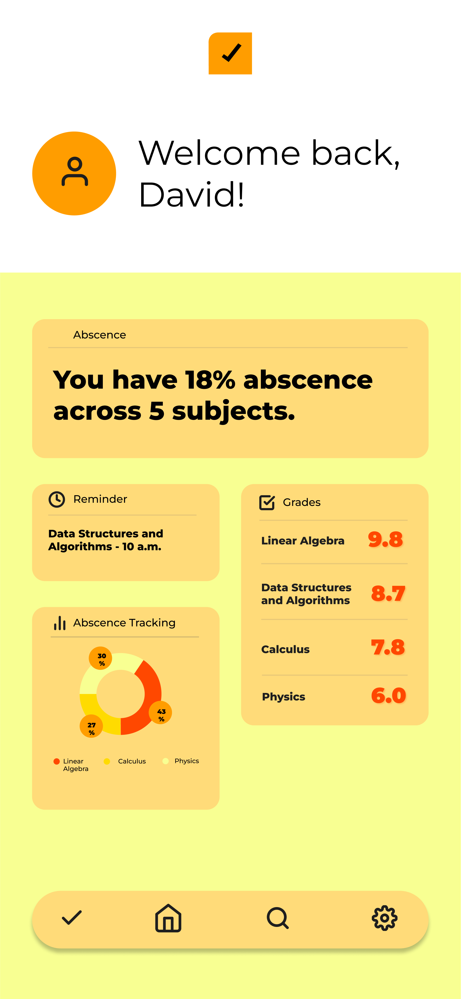

# 🟧 Dismissipline — your. class. tracker.

**Dismissipline** is a personal academic tracking tool designed to help students monitor **absences**, **grades**, and **disciplinary performance** in a clean and intuitive way.  

Built from scratch using **React**, this app combines **data visualization**, **personalization**, and a simple UI to keep your semester under control.

---

## 📱 Features

- ✅ **Track absences by subject**
- 📅 **Receive reminders** for upcoming classes
- 📊 **Visualize attendance data** with clean charts
- 🧠 **Record grades** and view current averages
- ⚠️ **Alerts** for high absence rates or low performance
- 🌙 **Mobile-first, responsive interface**
- 🚀 **Deploy-ready** and easy to install

---

## 🖼️ Screenshots



---

## 🛠 Tech Stack

| Frontend | Tool           |
|----------|----------------|
| Framework | React + Vite |
| Styling   | Tailwind CSS |
| Icons     | Lucide / Heroicons |
| Charts    | Chart.js / ApexCharts |
| Deploy    | Vercel        |

---

## 🚧 Project Structure (WIP)
```bash
src/
├── assets/ # Logos, icons, visuals
├── components/ # Reusable UI components
├── pages/ # Page views like Dashboard
├── services/ # API or localStorage logic
├── styles/ # Tailwind or CSS files
├── App.jsx
└── main.jsx

```
---

## 🧪 How to run locally

```bash
# Clone the repo
git clone https://github.com/seu-usuario/dismissipline.git

# Navigate to project folder
cd dismissipline

# Install dependencies
npm install

# Run locally
npm run dev
```
---
## 📦 Future Enhancements
- Full CRUD with backend (Node + MongoDB)

- Login/authentication with JWT

- Dark mode

- Export reports as PDF

- Notifications (browser or email)
---

## ✨ Inspiration

This project was born out of a personal need for a more visual, modern and user-friendly way to track attendance and academic progress — and to combine design + dev in one smart solution.

---

Made with ☕, React and a touch of orange by @Jg-365

